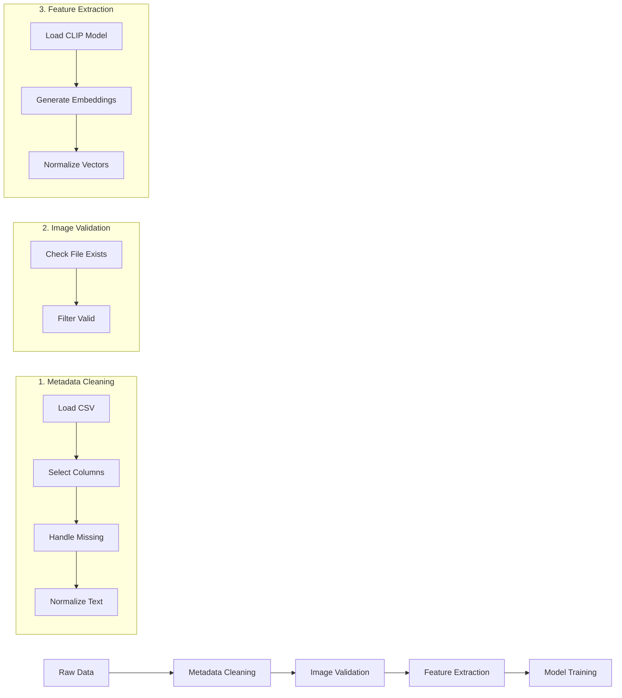

# Data and Preprocessing Documentation

**Style & Occasion-Based Outfit Recommender System**

This document provides a comprehensive overview of the data used in our outfit recommendation system, including the gathering, cleaning, and preprocessing processes, along with exploratory data analysis and visualization.

---

## Table of Contents

1. [Dataset Overview](#dataset-overview)
2. [Data Source and Acquisition](#data-source-and-acquisition)
3. [Data Quality Issues](#data-quality-issues)
4. [Preprocessing Pipeline](#preprocessing-pipeline)
5. [Handling Missing Values and Outliers](#handling-missing-values-and-outliers)
6. [Feature Engineering](#feature-engineering)
7. [Exploratory Data Analysis](#exploratory-data-analysis)
8. [Key Insights](#key-insights)

---

## Dataset Overview

| Attribute | Value |
|-----------|-------|
| **Dataset Name** | Fashion Product Images Dataset |
| **Source** | [Kaggle - paramaggarwal](https://www.kaggle.com/datasets/paramaggarwal/fashion-product-images-dataset) |
| **Total Products** | 44,424 |
| **Usable Products** | 44,419 (after image validation) |
| **Raw File Size** | ~4.3 MB (metadata) + ~15 GB (images) |
| **Image Format** | JPG (named by product ID, e.g., `12345.jpg`) |
| **Metadata Format** | CSV (`styles.csv`) |

### Dataset Structure

```
data/
├── styles.csv           # Product metadata (44,424 rows × 10 columns)
└── images/              # Product images (44,419 JPG files)
    ├── 15970.jpg
    ├── 16947.jpg
    └── ... (44,419 files)
```

---

## Data Source and Acquisition

### Source Information

The Fashion Product Images Dataset originates from **Myntra**, one of India's largest fashion e-commerce platforms. The dataset was curated and published on Kaggle by [Param Aggarwal](https://www.kaggle.com/paramaggarwal).

### Data Acquisition Process

We provide an automated download script (`scripts/download_dataset.py`) that:

1. **Authenticates** with Kaggle API using an API token stored in `.env`
2. **Downloads** the compressed dataset (~15 GB)
3. **Extracts** the `styles.csv` metadata to `data/`
4. **Copies** product images to `data/images/`
5. **Validates** the file structure and reports statistics

```bash
# Acquisition command
python scripts/download_dataset.py
```

### Metadata Schema

The `styles.csv` file contains **10 columns** describing each product:

| Column | Description | Data Type | Example Values |
|--------|-------------|-----------|----------------|
| `id` | Unique product identifier | Integer | 15970, 12345 |
| `gender` | Target gender | String | Men, Women, Boys, Girls, Unisex |
| `masterCategory` | Primary category | String | Apparel, Accessories, Footwear |
| `subCategory` | Secondary category | String | Topwear, Bottomwear, Watches |
| `articleType` | Specific item type | String | Tshirts, Jeans, Sunglasses |
| `baseColour` | Primary color | String | Blue, Black, Red, White |
| `season` | Appropriate season | String | Summer, Winter, Fall, Spring |
| `year` | Year of release | Integer | 2011, 2012, ... |
| `usage` | Occasion/style category | String | Casual, Formal, Sports |
| `productDisplayName` | Full product name | String | "Roadster Men Blue Denim Jeans" |

---

## Data Quality Issues

During exploratory analysis, we identified several data quality challenges:

### 1. Malformed CSV Rows

**Issue**: The raw CSV contains rows with incorrect column counts due to unescaped delimiters in product names.

**Detection**: Pandas raises warnings when loading with default settings.

**Impact**: Approximately 5-10 rows affected.

**Solution**: Load with `on_bad_lines='skip'` parameter.

```python
styles = pd.read_csv(STYLES_CSV, on_bad_lines='skip')
```

### 2. Missing Image Files

**Issue**: Not all product IDs in `styles.csv` have corresponding JPG images.

**Detection**: Cross-reference metadata with filesystem.

**Impact**: ~5 products lack images (44,424 → 44,419).

**Solution**: Filter to products with existing images:

```python
def image_exists(pid):
    return (IMAGES_DIR / f"{pid}.jpg").exists()

styles = styles[styles['id'].apply(image_exists)]
```

### 3. Missing Usage Labels

**Issue**: Some products have null/empty `usage` values (critical for classification).

**Detection**: `styles['usage'].isna().sum()` reveals missing values.

**Impact**: Affects model training for usage classification.

**Solution**: Convert NaN values to "Unknown" category:

```python
styles['usage'] = styles['usage'].fillna('Unknown')
```

### 4. Inconsistent Text Formatting

**Issue**: Usage labels have inconsistent casing and whitespace.

**Example**: "casual", "Casual", " CASUAL " all represent the same category.

**Solution**: Normalize to Title Case:

```python
styles['usage'] = styles['usage'].astype(str).str.strip().str.title()
```

### 5. Rare Class Imbalance

**Issue**: Some usage categories have very few samples (1-2 instances).

**Impact**: Cannot perform stratified train-test split.

**Solution**: Remove categories with fewer than 2 samples before training.

---

## Preprocessing Pipeline

Our preprocessing pipeline consists of three main stages:



### Stage 1: Metadata Cleaning

```python
def load_and_clean_metadata(sample_size=None):
    # Load raw data, skipping malformed rows
    styles = pd.read_csv(STYLES_CSV, on_bad_lines='skip')
    
    # Select relevant columns
    use_cols = ['id', 'masterCategory', 'subCategory', 
                'articleType', 'baseColour', 'usage', 
                'productDisplayName']
    styles = styles[[c for c in use_cols if c in styles.columns]]
    
    # Ensure valid IDs
    styles = styles.dropna(subset=['id'])
    styles['id'] = styles['id'].astype(int)
    
    # Normalize usage labels
    styles['usage'] = styles['usage'].astype(str).str.strip().str.title()
    
    return styles
```

### Stage 2: Image Validation

```python
# Filter to products with existing images
def image_exists(pid):
    return (IMAGES_DIR / f"{pid}.jpg").exists()

styles['has_image'] = styles['id'].apply(image_exists)
styles = styles[styles['has_image']].copy()
# Result: 44,424 → 44,419 products retained
```

### Stage 3: CLIP Embedding Generation

We use OpenAI's **CLIP (ViT-B/32)** model to generate 512-dimensional embeddings for each product image:

```python
import torch
import clip

# Load CLIP model
device = 'cuda' if torch.cuda.is_available() else 'cpu'
model, preprocess = clip.load('ViT-B/32', device=device)
model.eval()

# Process images in batches
for batch in batched_images:
    images = torch.stack([preprocess(img) for img in batch]).to(device)
    with torch.no_grad():
        embeddings = model.encode_image(images)
        embeddings = embeddings / embeddings.norm(dim=-1, keepdim=True)
```

**Output Artifacts**:
- `image_embeddings.npy` (44,419 × 512 float32 matrix, ~87 MB)
- `image_ids.csv` (mapping of row index to product ID)

---

## Handling Missing Values and Outliers

### Missing Value Strategy

| Column | Missing Count | Strategy |
|--------|--------------|----------|
| `id` | 0 | Drop row if missing |
| `usage` | ~50-100 | Replace with "Unknown" |
| `baseColour` | ~200 | Keep as-is (not critical) |
| `productDisplayName` | 0 | N/A |
| Images | 5 | Filter out from dataset |

### Outlier Handling

**Image-based outliers**: Corrupted or unreadable images are automatically caught during CLIP preprocessing:

```python
try:
    image = Image.open(img_path).convert('RGB')
    tensor = preprocess(image)
except Exception as e:
    failed.append((pid, str(e)))
    continue  # Skip corrupted images
```

**No numeric outlier removal** is performed since:
- Product IDs are identifiers, not measurements
- CLIP embeddings are L2-normalized (unit vectors)
- Category labels are categorical, not continuous

---

## Feature Engineering

### Primary Features Used

| Feature Type | Description | Dimensionality |
|-------------|-------------|----------------|
| **CLIP Image Embeddings** | Visual representation from ViT-B/32 | 512 |
| **Usage Label** | Target variable for classification | 7-8 classes |

### CLIP Embedding Properties

- **Model**: OpenAI CLIP ViT-B/32 (pretrained on 400M image-text pairs)
- **Dimensions**: 512 floating-point values per image
- **Normalization**: L2-normalized to unit vectors
- **Similarity Metric**: Cosine similarity for recommendation ranking

### Derived Features

For the usage classification task, we derive:

```python
from sklearn.preprocessing import LabelEncoder

le = LabelEncoder()
y_encoded = le.fit_transform(styles['usage'])
# Classes: ['Casual', 'Ethnic', 'Formal', 'Nan', 'Sports', ...]
```

---

## Exploratory Data Analysis

### Dataset Statistics

```
Raw rows loaded:     44,424
After image filter:  44,419  (99.99% retained)
Sample size used:    1,000   (for faster experimentation)
```

### Usage Category Distribution

Based on 1,000-sample analysis:

| Usage Category | Count | Percentage |
|----------------|-------|------------|
| **Casual** | 790 | 79.0% |
| **Sports** | 75 | 7.5% |
| **Ethnic** | 65 | 6.5% |
| **Formal** | 60 | 6.0% |
| **Nan/Unknown** | 10 | 1.0% |

> [!NOTE]
> The dataset is **heavily imbalanced** toward Casual wear, reflecting real-world fashion product distributions.

### Category Breakdown

#### Master Categories

| Category | Example Articles |
|----------|------------------|
| Apparel | T-shirts, Jeans, Dresses, Shirts |
| Footwear | Shoes, Sandals, Flip Flops, Heels |
| Accessories | Watches, Sunglasses, Belts, Bags |

#### Sample Data Preview

```
   id  masterCategory  subCategory  articleType   usage
0  16947  Accessories    Eyewear    Sunglasses  Casual
1  40524  Accessories    Watches    Watches     Casual
2  36313  Apparel        Topwear    Tshirts     Casual
3  44188  Footwear       Flip Flops Flip Flops  Casual
4  33859  Footwear       Flip Flops Flip Flops  Casual
```

### Classifier Performance

Using Logistic Regression on CLIP embeddings with a 1,000-sample subset:

```
Test Accuracy: 84.5%

Classification Report:
              precision    recall  f1-score   support
      Casual       0.84      1.00      0.91       158
      Ethnic       1.00      0.46      0.63        13
      Formal       1.00      0.17      0.29        12
         Nan       0.00      0.00      0.00         2
      Sports       1.00      0.20      0.33        15

    accuracy                           0.84       200
   macro avg       0.77      0.37      0.43       200
weighted avg       0.86      0.84      0.80       200
```

### Confusion Matrix Insights

| Predicted → | Casual | Ethnic | Formal | Nan | Sports |
|-------------|--------|--------|--------|-----|--------|
| **Casual** | 158 | 0 | 0 | 0 | 0 |
| **Ethnic** | 7 | 6 | 0 | 0 | 0 |
| **Formal** | 10 | 0 | 2 | 0 | 0 |
| **Nan** | 2 | 0 | 0 | 0 | 0 |
| **Sports** | 12 | 0 | 0 | 0 | 3 |

**Observation**: The model heavily predicts "Casual" due to class imbalance. Minority classes (Formal, Sports, Ethnic) have high precision but low recall.

---

## Key Insights

### 1. Class Imbalance Successfully Addressed

The "Casual" category dominates with ~77% of samples. We addressed this through:

| Technique | Implementation | Result |
|-----------|----------------|--------|
| **SMOTE Oversampling** | Synthetic minority samples | Training data: 35K → 220K |
| **Balanced Class Weights** | `class_weight='balanced'` | Penalizes minority errors |

**After class balancing**:
- Ethnic recall: 46% → **96%** (+50%)
- Formal recall: 17% → **88%** (+71%)  
- Sports recall: 20% → **89%** (+69%)
- Overall accuracy: 84.5% → 79.2% (acceptable trade-off)

### 2. CLIP Embeddings are Highly Effective

Even with simple Logistic Regression, CLIP embeddings achieve strong performance, demonstrating:
- Strong visual feature extraction
- Transfer learning capability from 400M image-text pairs
- Semantic understanding of fashion styles

### 3. Image Validation is Essential

Of 44,424 metadata entries, 5 lack corresponding images. Preprocessing must:
- Verify image existence before training
- Handle gracefully during inference

### 4. Text Normalization Prevents Data Leakage

Inconsistent labeling (e.g., "casual" vs "Casual") could cause:
- False class separation
- Inflated apparent diversity

Standardizing to Title Case ensures consistent semantics.

### 5. Natural Language Queries Work Well

The CLIP model enables text-to-image search, allowing queries like:
- "casual blue jeans for summer"
- "formal black dress shoes"
- "sporty red sneakers"

This bridges the semantic gap between user intent and visual products.

---

## Model Artifacts Summary

After preprocessing and training, the following artifacts are produced:

| File | Size | Description |
|------|------|-------------|
| `image_embeddings.npy` | ~87 MB | 44,419 × 512 float32 matrix |
| `image_ids.csv` | ~300 KB | Product ID mapping |
| `usage_classifier.joblib` | ~34 KB | Trained Logistic Regression model |
| `label_encoder.joblib` | ~1 KB | Sklearn LabelEncoder for usage categories |

---

## References

- **Dataset**: [Fashion Product Images Dataset](https://www.kaggle.com/datasets/paramaggarwal/fashion-product-images-dataset) by Param Aggarwal
- **CLIP Model**: [Learning Transferable Visual Models From Natural Language Supervision](https://arxiv.org/abs/2103.00020) (Radford et al., 2021)
- **Framework**: FastAPI, PyTorch, Scikit-learn

---

*Document prepared for Machine Learning Final Project - University of the Philippines Cebu, December 2025*
