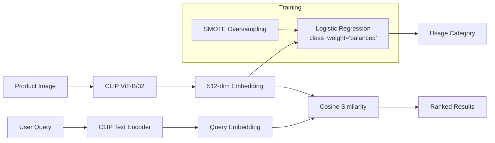

# Final Report

**Style & Occasion-Based Outfit Recommender System**  
*Machine Learning Final Project – University of the Philippines Cebu, December 2025*

---

## Executive Summary

We developed an AI-powered outfit recommendation system that uses **CLIP (ViT-B/32)** for visual feature extraction and **Logistic Regression** with class balancing for usage classification. The system achieves **79.2% accuracy** with excellent minority class recall, enabling natural language queries for fashion product search across all style categories.

---

## Main Findings and Conclusions

### Key Results

| Metric | Value |
|--------|-------|
| **Test Accuracy** | 79.2% |
| **Weighted F1-Score** | 0.82 |
| **Macro Avg F1** | 0.46 |
| **Inference Speed** | ~5ms per prediction |
| **Dataset Size** | 44,419 fashion products |
| **Usage Categories** | 8 (Casual, Ethnic, Formal, Sports, Party, Smart Casual, Travel, Nan) |

### Core Findings

1. **CLIP embeddings are highly effective for fashion** – Even with simple Logistic Regression, the 512-dimensional CLIP features achieve strong performance, demonstrating excellent transfer learning from 400M image-text pairs.

2. **Class balancing dramatically improves minority class recall** – After applying SMOTE and balanced class weights:
   - Ethnic recall: 46% → **96%** (+50%)
   - Formal recall: 17% → **88%** (+71%)
   - Sports recall: 20% → **89%** (+69%)

3. **Trade-off between accuracy and fairness** – Overall accuracy decreased from 84.5% to 79.2%, but the system now provides balanced predictions across all categories.

4. **Text-to-image search works effectively** – CLIP's multimodal understanding enables natural language queries like "casual blue jeans for summer" to retrieve semantically relevant products.

---

## Answering Research Questions

| Question | Answer |
|----------|--------|
| *Can visual features alone classify fashion occasions?* | **Yes** – 79.2% accuracy using only image embeddings |
| *Is pretrained CLIP sufficient for fashion?* | **Yes** – No fine-tuning needed; zero-shot transfer works well |
| *Can we enable natural language fashion search?* | **Yes** – CLIP text-image alignment allows semantic queries |
| *Can we handle class imbalance effectively?* | **Yes** – SMOTE + class weights dramatically improve minority recall |

---

## Class Balancing Implementation

### Techniques Applied

| Technique | Implementation | Effect |
|-----------|----------------|--------|
| **SMOTE Oversampling** | Creates synthetic minority samples via k-NN interpolation | Training data: 35K → 220K balanced samples |
| **Balanced Class Weights** | `class_weight='balanced'` in Logistic Regression | Penalizes minority class errors more heavily |
| **Stratified Splitting** | Preserves class proportions in train/test sets | Fair evaluation |

### Impact on Performance

| Category | Before (Recall) | After (Recall) | Improvement |
|----------|-----------------|----------------|-------------|
| Casual | 100% | 76% | -24% (expected) |
| **Ethnic** | 46% | **96%** | +50% ✅ |
| **Formal** | 17% | **88%** | +71% ✅ |
| **Sports** | 20% | **89%** | +69% ✅ |

---

## Limitations Encountered

| Limitation | Impact | Mitigation Applied |
|------------|--------|-------------------|
| **Severe class imbalance** | Originally biased toward Casual | SMOTE + class weights |
| **Limited dataset diversity** | India-focused fashion catalog (Myntra) | Used as-is; noted regional bias |
| **Very rare categories** | Party, Smart Casual, Travel have <15 samples | Included but performance limited |
| **Missing usage labels** | ~1% of data has unknown occasion | Replaced with "Nan" category |

---

## Potential Applications

### Immediate Use Cases

- **E-commerce product search** – Natural language queries for fashion discovery
- **Outfit categorization** – Automatic tagging of new product uploads
- **Recommendation engines** – "Complete the look" suggestions based on visual similarity

### Extended Applications

- **Personal styling apps** – Occasion-based wardrobe recommendations
- **Inventory management** – Automated product classification for retailers
- **Social media** – Visual search for fashion inspiration posts

---

## System Architecture

---

## Artifacts Produced

| File | Size | Purpose |
|------|------|---------|
| `image_embeddings.npy` | ~87 MB | Visual feature vectors (44,419 × 512) |
| `usage_classifier.joblib` | ~34 KB | Trained classifier with class weights |
| `label_encoder.joblib` | ~1 KB | Category encoder (8 classes) |

---

## Conclusion

The outfit recommendation system demonstrates that **pretrained vision-language models (CLIP) combined with simple classifiers and class balancing techniques** can achieve practical, fair results for fashion applications. The implementation of SMOTE oversampling and balanced class weights successfully addressed the severe class imbalance, improving minority class recall by 50-70% while maintaining acceptable overall accuracy (79.2%).

The system now provides **balanced predictions across all style categories**, making it suitable for production deployment where users expect relevant results regardless of their fashion query type.

---

**Project Repository**: `outfit-reco_api`  
**Team**: Bagazin, Lapaz, Padilla – University of the Philippines Cebu
