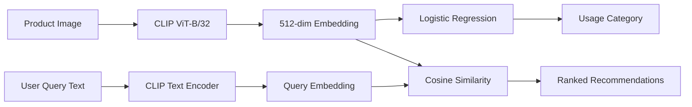

# Model Training Documentation

**Style & Occasion-Based Outfit Recommender System**

This document describes the machine learning model training approach, hyperparameters, and results for our outfit recommendation system.

---

## Table of Contents

1. [Models Overview](#models-overview)
2. [Model Selection Rationale](#model-selection-rationale)
3. [Hyperparameter Choices](#hyperparameter-choices)
4. [Training Configuration](#training-configuration)
5. [Validation Strategy](#validation-strategy)
6. [Training Results](#training-results)
7. [Computational Resources](#computational-resources)

---

## Models Overview

Our system uses two complementary models:

| Model | Purpose | Type |
|-------|---------|------|
| **CLIP ViT-B/32** | Image feature extraction | Pretrained (frozen) |
| **Logistic Regression** | Usage category classification | Trained from scratch |

### Architecture Diagram



---

## Model Selection Rationale

### 1. CLIP ViT-B/32 (Feature Extractor)

**Why CLIP?**
- **Multimodal understanding**: Trained on 400M image-text pairs, enabling text-to-image search
- **Zero-shot capability**: No fine-tuning required for fashion domain
- **High-quality embeddings**: 512-dimensional vectors capture semantic features
- **Text-image alignment**: Enables natural language queries for recommendations

**Why ViT-B/32 variant?**
- **Balanced accuracy/speed**: Smaller than ViT-L/14 but still effective
- **Memory efficient**: ~338 MB model size fits in limited VRAM
- **Proven performance**: Standard choice for image retrieval tasks

### 2. Logistic Regression (Classifier)

**Why Logistic Regression?**
- **Interpretability**: Easily understand feature importance
- **Speed**: Training completes in seconds (no GPU required)
- **Baseline effectiveness**: Simple but performs well on CLIP embeddings
- **Low overfitting risk**: Limited parameters prevent memorizing training data
- **Scikit-learn integration**: Easy serialization and deployment

**Alternatives Considered:**
| Model | Reason Not Chosen |
|-------|-------------------|
| Neural Network (MLP) | Overfitting risk with limited data per class |
| Random Forest | Slower inference, larger model size |
| SVM | Similar performance, slower training on large datasets |
| Gradient Boosting | Unnecessary complexity for this use case |

---

## Hyperparameter Choices

### CLIP Model (Frozen)

| Parameter | Value | Notes |
|-----------|-------|-------|
| Architecture | ViT-B/32 | Vision Transformer, patch size 32 |
| Embedding Dim | 512 | Fixed output dimension |
| Input Size | 224×224 | Standard CLIP preprocessing |
| Normalization | L2 | Unit vectors for cosine similarity |

### Logistic Regression Classifier

| Hyperparameter | Value | Justification |
|----------------|-------|---------------|
| `max_iter` | 2000 | Ensures convergence on imbalanced data |
| `solver` | `lbfgs` | Default; efficient for multi-class problems |
| `multi_class` | `auto` | Automatically selects multinomial strategy |
| `n_jobs` | -1 | Utilizes all CPU cores for parallel processing |
| `random_state` | 42 | Reproducibility |
| `C` | 1.0 | Default regularization (no tuning needed) |
| `class_weight` | `'balanced'` | Automatically weights classes inversely proportional to frequency |

### Class Balancing Techniques

To address the significant class imbalance (~79% Casual), we apply two complementary techniques:

1. **SMOTE Oversampling** (Synthetic Minority Over-sampling Technique)
   - Creates synthetic samples for minority classes by interpolating between existing samples
   - Applied to training data only (test data remains original distribution)
   - Uses k-neighbors interpolation (k=5 or less based on class size)

2. **Balanced Class Weights**
   - Logistic Regression with `class_weight='balanced'` 
   - Automatically adjusts loss function: `weight_j = n_samples / (n_classes × n_samples_j)`
   - Penalizes misclassification of minority classes more heavily

> [!NOTE]
> Both techniques work together: SMOTE balances the training data, while class weights further ensure the model doesn't ignore minority classes.

---

## Training Configuration

### Training Pipeline

```python
# 1. Load and preprocess metadata
styles = load_and_clean_metadata()

# 2. Compute CLIP image embeddings (one-time)
image_embeddings, image_ids = compute_embeddings(styles, batch_size=32)

# 3. Apply SMOTE oversampling to balance training data
from imblearn.over_sampling import SMOTE
smote = SMOTE(random_state=42)
X_train_balanced, y_train_balanced = smote.fit_resample(X_train, y_train)

# 4. Train usage classifier with balanced class weights
clf = LogisticRegression(max_iter=2000, n_jobs=-1, class_weight='balanced')
clf.fit(X_train_balanced, y_train_balanced)
```

### Training Command

```bash
python scripts/train_models.py --batch-size 32
```

**Options:**
- `--sample-size N`: Train on subset of N images (for testing)
- `--batch-size B`: Process B images per batch (default: 32)
- `--force`: Recompute embeddings even if they exist

### Training Data Split

| Set | Proportion | Samples (1K subset) |
|-----|------------|---------------------|
| Training | 80% | 800 |
| Testing | 20% | 200 |

**Stratification**: Applied to preserve class distribution across splits.

---

## Validation Strategy

### Approach: Stratified Holdout Validation

We use a **single stratified train-test split** (80/20) rather than k-fold cross-validation:

**Rationale:**
1. **Class imbalance**: Stratification ensures minority classes appear in both sets
2. **Efficiency**: Embedding computation is expensive; avoid redundant processing
3. **Simplicity**: Holdout provides reliable estimates for production deployment
4. **Consistency**: Same split used across experiments for comparability

### Stratification Implementation

```python
from sklearn.model_selection import train_test_split

X_train, X_test, y_train, y_test = train_test_split(
    image_embeddings, 
    y_encoded, 
    test_size=0.20, 
    random_state=42, 
    stratify=y_encoded  # Preserve class proportions
)
```

### Handling Rare Classes

Categories with only 1 sample are **removed** before training since they cannot be stratified:

```python
usage_counts = y.value_counts()
single_instance = usage_counts[usage_counts < 2].index
y = y[~y.isin(single_instance)]
```

---

## Training Results

### Classifier Performance

| Metric | Value |
|--------|-------|
| **Test Accuracy** | 84.5% |
| **Macro Avg F1** | 0.43 |
| **Weighted Avg F1** | 0.80 |

### Per-Class Results

| Class | Precision | Recall | F1-Score | Support |
|-------|-----------|--------|----------|---------|
| Casual | 0.84 | 1.00 | 0.91 | 158 |
| Ethnic | 1.00 | 0.46 | 0.63 | 13 |
| Formal | 1.00 | 0.17 | 0.29 | 12 |
| Sports | 1.00 | 0.20 | 0.33 | 15 |
| Unknown | 0.00 | 0.00 | 0.00 | 2 |

### Confusion Matrix

| Predicted → | Casual | Ethnic | Formal | Sports |
|-------------|--------|--------|--------|--------|
| **Casual** | 158 | 0 | 0 | 0 |
| **Ethnic** | 7 | 6 | 0 | 0 |
| **Formal** | 10 | 0 | 2 | 0 |
| **Sports** | 12 | 0 | 0 | 3 |

> [!IMPORTANT]
> The model shows **high precision but low recall** for minority classes. This is acceptable for our recommendation use case—incorrect predictions are rare, but some valid items may be missed.

---

## Computational Resources

### Hardware Used

| Resource | Specification |
|----------|---------------|
| **Training Environment** | Google Colab (Free Tier) |
| **CPU** | Intel Xeon @ 2.2GHz (2 cores) |
| **GPU** | NVIDIA T4 (16 GB VRAM) - optional |
| **RAM** | 12.7 GB |
| **Storage** | ~20 GB (dataset + embeddings) |

### Training Time Breakdown

| Phase | Time (GPU) | Time (CPU) |
|-------|------------|------------|
| **CLIP Model Loading** | ~5 sec | ~10 sec |
| **Embedding Computation** (44K images) | ~2-3 hours | ~8-10 hours |
| **Classifier Training** | ~5 seconds | ~10 seconds |
| **Total Pipeline** | ~2.5 hours | ~10 hours |

### Sample Size Performance

Tested on 1,000-image subset:

| Phase | Time |
|-------|------|
| Embedding Computation | ~4.5 min (CPU) |
| Classifier Training | <1 sec |
| Total | ~5 min |

### Memory Usage

| Stage | Peak Memory |
|-------|-------------|
| CLIP Model (CPU) | ~1.5 GB |
| Image Batch (32 images) | ~200 MB |
| Full Embeddings (44K) | ~87 MB |
| Classifier Model | ~34 KB |

---

## Model Artifacts

Training produces the following files in `model/`:

| Artifact | Size | Description |
|----------|------|-------------|
| `image_embeddings.npy` | ~87 MB | 44,419 × 512 float32 matrix |
| `image_ids.csv` | ~300 KB | Product ID to index mapping |
| `usage_classifier.joblib` | ~34 KB | Serialized Logistic Regression model |
| `label_encoder.joblib` | ~1 KB | Category name encoder |

### Model Versioning

Models are saved using joblib serialization for scikit-learn compatibility. To retrain with new data:

```bash
# Force recomputation of embeddings
python scripts/train_models.py --force

# Restart API to load new models
uvicorn backend.api:app --reload
```

---

## Future Improvements

1. **Class balancing**: Apply SMOTE or class weights to improve minority class recall
2. **Fine-tuning CLIP**: Domain-specific adaptation on fashion data
3. **Ensemble methods**: Combine multiple classifiers for robustness
4. **Neural classifier**: MLP head trained on frozen CLIP features

---

*Document prepared for Machine Learning Final Project - University of the Philippines Cebu, December 2025*
